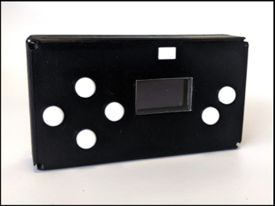
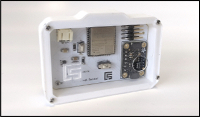
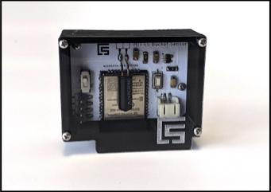
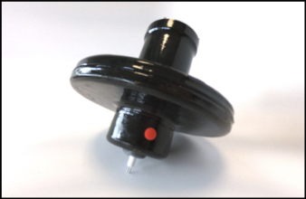

<div align="center">
      
      

</div><br><br><br>

<h1> axol </h1>

Sensors for granular assessment of water usage patterns in informal settlements.

This repository contains all files needed to replicate a fully functional Axol sensing system.

The current version of the system is has four sensor types and a HomeHub communication device. The four sensing units include tank sensors, bucket sensors, quality sensors and environmental sensors.

Andres Rico - MIT Media Lab - <aricom@mit.edu>


<h1>Devices</h1>


<h2><a href="https://github.com/AndresRicoM/axol/tree/main/homehub">HomeHub</a></h2>

The HomeHub acts as a user interface and as the centralized data relay for the system. All of the sensing units send the data directly to a HomeHub. The HomeHub formats and sends the infroamtion to a remote database. 

Note: It is advised to firstly manufacture a HomeHub device as all other sensors directly connect to the HomeHub. 

<h2><a href="https://github.com/AndresRicoM/axol/tree/main/sensors/tank_sensor">Tank Sensor</a></h2>

<p align="left">
      
      
</p>

The tank sensor uses Adafruits VXL ToF distance sensor. It measures the distance between a water tanks lid and the water line. With this information we can calculate a containers used volume to detemrine how much water is stored within the container. 

<h2><a href="https://github.com/AndresRicoM/axol/tree/main/sensors/bucket_sensor">Bucket Sensor</a></h2>
<p align="left">
      
      
</p>

The bucket sensor uses a simple tilt switch. The switch is closed whenever a bucket is flipped. Everytime that the switch is activated, the sensor sends a notice to the HomeHub and the HomeHub timestamps the information before sending it to the database. 

<h2><a href="https://github.com/AndresRicoM/axol/tree/main/sensors/water_quality_sensor">Quality Sensor</a></h2>

<p align="left">
      
      
</p>

The quality sensor measures EC in water to get an estimate of Total Dissolved Solids. 


<h2>Environmental Sensor</h2>
The environmental sensor uses an STH sensor to measure enviroenmental temperature and humidity. The sensor can be a good way to evaluate system and battery performance. It can also be used to track environemetal variables of places were the other sensors are placed. 

<h1>Programming Devices</h1>

Devices can be easily programmed using the [Arduino IDE](https://www.arduino.cc/en/software). You will need to make sure that you have the Espressif [ESP32 core](https://github.com/espressif/arduino-esp32) installed along with all required libraries. 

We need a [USB-TTL adapter](https://duckduckgo.com/?q=USB-TTL+adapter&atb=v313-1&iax=images&ia=images) to program the sensor. 

- Connect Cables as Follows:

```
Device - Adapter
V+   ------ 3.3V (or 5V)
GND  ------ GND
TX   ------ RX
RX   ------ TX
```

NOTE: MAKE SURE TO DISCONNECT ANY POWER SUPPLY. THE BOARD SHOULD ONLY BE POWERED BY THE ADAPTER CABLES. 
NOTE: EACH DEVICE HAS A DIFFERENT PIN ORDER, REFERENCE EACH DEVICE'S PIN DIAGRAM TO MAKE SURE YOU ARE CONNECTING PINS CORRECTLY. 

- Once connection is done, open your serial monitor at a 115200 baud rate, click the reset button on the device and verify that you see inforamtion. 
- Set ESP to Boot Mode. To set the device on bootmode, press the reset button
- Upload sketch 
- Reset device. Toggle switch to opposite position and presss the reset button. 

<h1>Querying Data</h1>

All system data can be queried through available [API calls](https://github.com/AndresRicoM/axol/wiki/API-Documentation). The calls allow you to get information on network status as well as to access all data for all registered sensors. You will need to firstly register a HomeHub as your HomeHub's Mac Add will act as your key to access all of your systems data.

<h1>Device Registration</h1>

Each device needs to be individually registered. You can register all devices [here](http://blindspot.media.mit.edu/homehubweb/registration.html). 

All sensors must be paired with a HomeHub that has been previously registered. 

<h1>Viewing your system's data </h1>

All sensors send their information to the HomeHub, the HomeHub then sends it into a database for storage, calculation of water volumes and consumption and visualization. 

You can check your systems data [here](http://blindspot.media.mit.edu/homehubweb/status_check.html)
By just typing in your HomeHubs registered MAC address. 


NOTE: ONLY REGISTERED HOMEHUBS WILL ALLOW TO SEE DATA IN THIS DASHBOARD


<h1>Data handling</h1>

The system uses the HomeHub to send data to a server hosted @MIT. All of the data of registered devices is accessible by the developers of the platform. If you do not want developers to have access you will need to build backend infrstructure that will allow you to save data in a different server and modify the 
   connect_send() 
   get_system_stats()
   server_send() 
   
function in the HomeHub's <a href="https://github.com/AndresRicoM/axol/blob/main/homehub/code/cs_homehub.ino">code</a>. 
