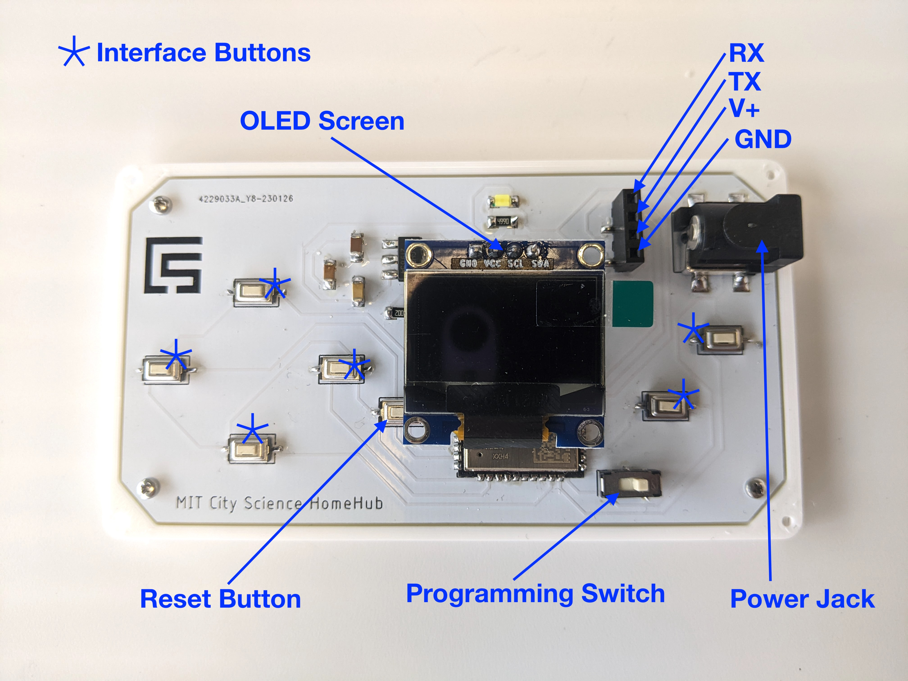
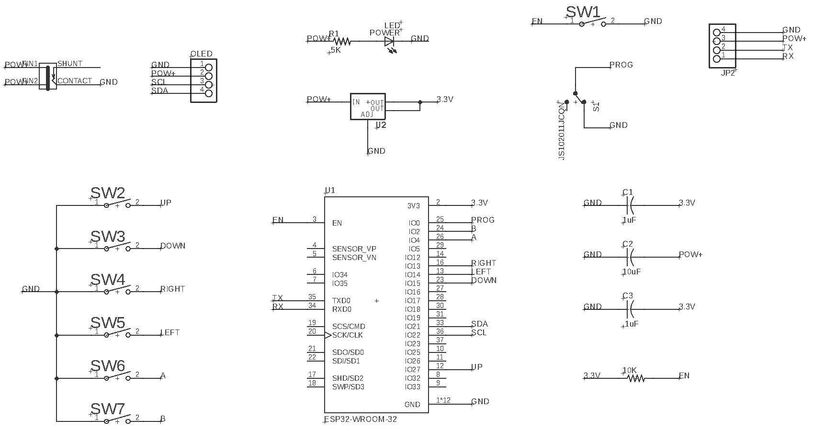
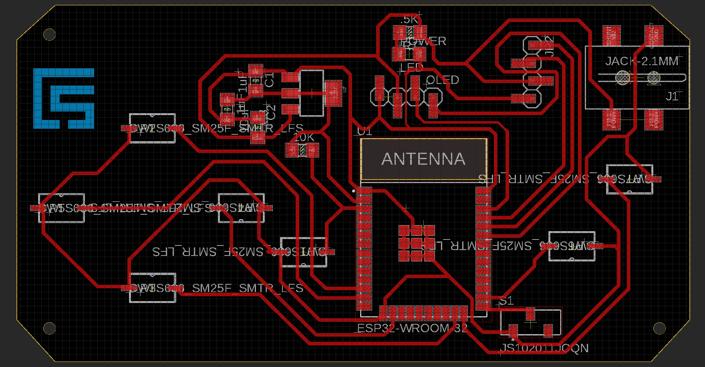

# AXOL

```
   █████╗ ██╗  ██╗ ██████╗ ██╗     
  ██╔══██╗╚██╗██╔╝██╔═══██╗██║     
  ███████║ ╚███╔╝ ██║   ██║██║     
  ██╔══██║ ██╔██╗ ██║   ██║██║     
  ██║  ██║██╔╝ ██╗╚██████╔╝███████╗
  ╚═╝  ╚═╝╚═╝  ╚═╝ ╚═════╝ ╚══════╝

  ᓬ(• - •)ᕒ

Andres Rico - MIT Media Lab - <aricom@mit.edu>

```

<h1>Homehub </h1>

<h2>Program Set-up</h2>
You will need to add your wifi credentials to the program. The device needs an SSID and a password. If the network is open. You can leave the password as an emptu string. 
Modify the following lines:

```
  //WIFI Variables
  const char* ssid = ""; //Change accordingly to connect to a WIFi network.
  const char* password = "";

```

You will also need to add your OpenWeather API key. If you do not have one, you can get a free key [here](https://openweathermap.org/api).
Add yout key in the following line:

```
  In the 

  get_complete_weather()

  fucntion, modify line:

  //Open Weather API Key
  const String key = "{Your Open Weather API Key}";

```

After modifying these lines, you are ready to upload the program to your device.

<h2>Bill Of Materials</h2>

```
quantity - component - estimated price

1 - ESP32-WROOM-32E-H4 - $3.15
1 - Switch (JS102011JCQN) - $0.65
1 - Button (PTS636 SM25F SMTR LFS) - $0.14140
1 - 0.1 uF Capacitor (C1206C104KARAC7800) - $0.14880	
1 - 1uF Capacitor (C3216X7R1H105K160AB) - $0.09680	
1 - 10uF Capacitor (GRT31CC8YA106ME01L) - $0.20060	
1 - Gikfun Metal Ball Tilt Shaking Position Switches - $0.399
1 - 500 mAh Lipo Battery 1578 - $7.95000	
1 - Battery Connector (S2B-PH-SM4-TB(LF)(SN)) - $0.41040	
1 - 3.3V Voltage Regulator (RT9080-33GJ5) - $0.25780	
1 - 4 POS Headers (GBC36SGSN-M89) - $0.47
1 - 10K Ohm Resistor (RC1206FR-0710KL) - $0.02

```

<h2>PCB Diagram</h2>



