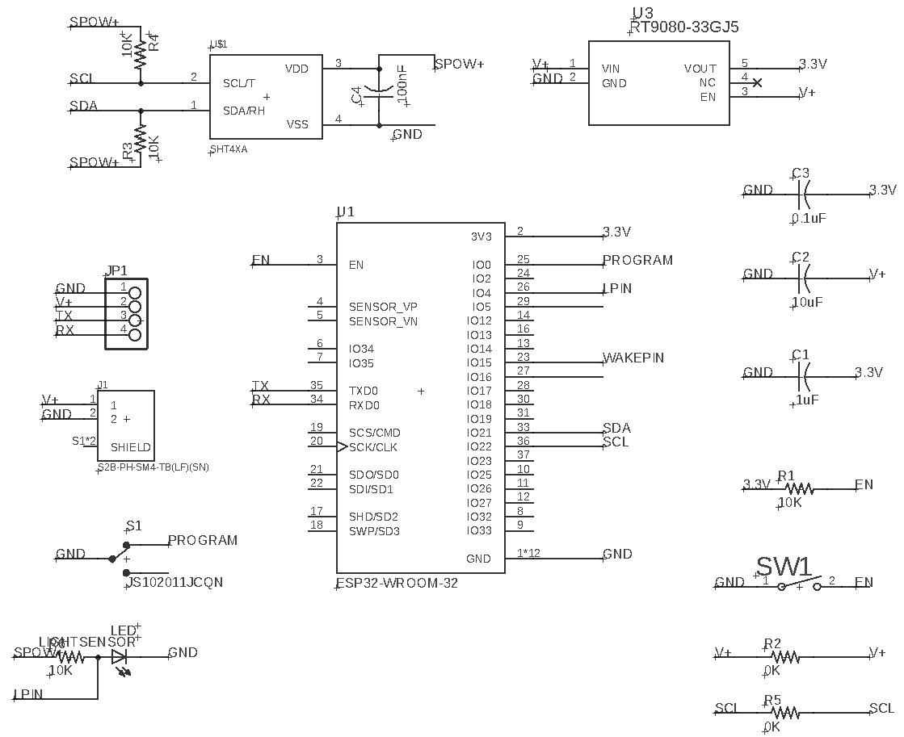
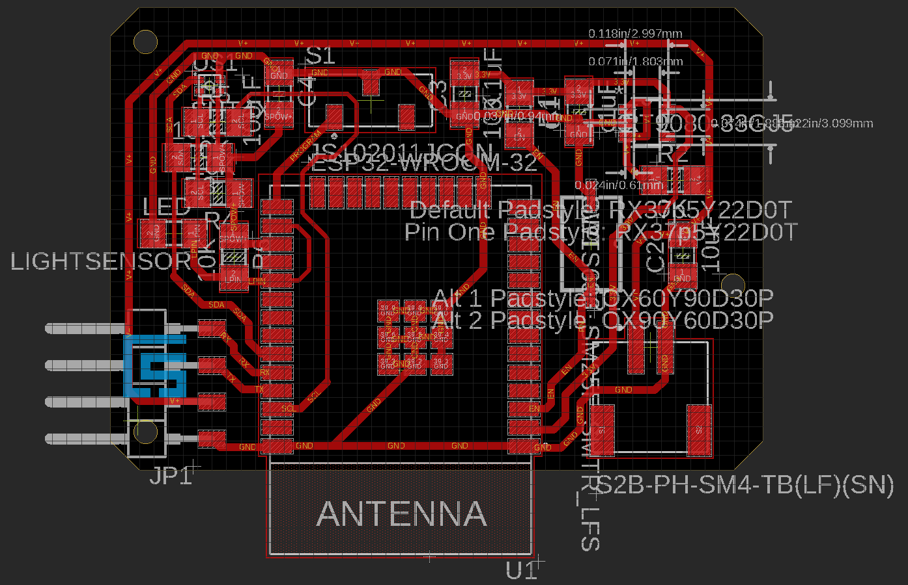

# AXOL

```
   █████╗ ██╗  ██╗ ██████╗ ██╗     
  ██╔══██╗╚██╗██╔╝██╔═══██╗██║     
  ███████║ ╚███╔╝ ██║   ██║██║     
  ██╔══██║ ██╔██╗ ██║   ██║██║     
  ██║  ██║██╔╝ ██╗╚██████╔╝███████╗
  ╚═╝  ╚═╝╚═╝  ╚═╝ ╚═════╝ ╚══════╝

  ᓬ(• - •)ᕒ

Andres Rico - MIT Media Lab - <aricom@mit.edu>

```

<h1>Environmental Sensor </h1>

<h2>Program Set-up</h2>

You will need to add your wifi credentials to the program. The device only needs an SSID for esp32 to activate. You do not need a password. Make sure that the SSID provided is the same as the one provided to you HomeHub. The devices need to be connected to the same network. To add SSID modify the following line:

```
  constexpr char WIFI_SSID[] = ""; //Network name, no password required.

```

You will also need to add the mac address of the HomeHub that the sensor will send its data to. To add the mac address modify the following line: 

Substitute each 00 pair with the specific digits of the Homehubs mac address.

```
  //Receiver address
  uint8_t broadcastAddress[] = {0x00, 0x00, 0x00, 0x00, 0x00, 0x00}; //MAC Address for receiving homehub.

```

After modifying these lines, you are ready to upload the program to your device.

<h2>Bill Of Materials</h2>

```
quantity - component - estimated price

1 - ESP32-WROOM-32E-H4 - $3.15
1 - Switch (JS102011JCQN) - $0.65
1 - Button (PTS636 SM25F SMTR LFS) - $0.14140
1 - 500 mAh Lipo Battery 1578 - $7.95000	
1 - Temp/Hum Sensor (SHT40I-AD1B-R3) - $2.45700	
3 - 10K Ohm Resistor (RC1206FR-0710KL) - $0.02
1 - Battery Connector (S2B-PH-SM4-TB(LF)(SN)) - $0.41040	
1 - Temp/Hum Sensor (SHT40I-AD1B-R3) - $2.45700	

```

<h2>PCB Diagram</h2>



